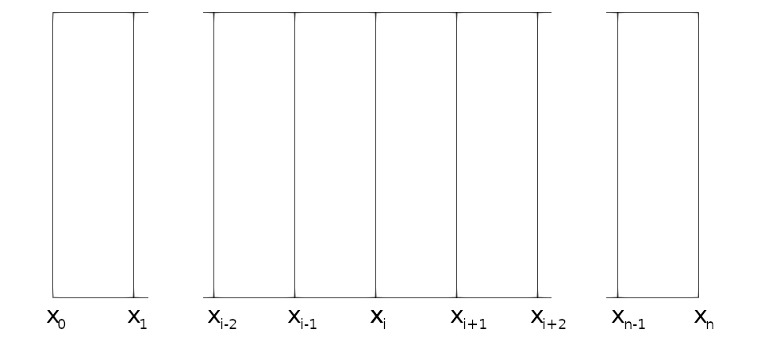

# 1 - Introduction

## Solving Mathematical Problems

In order to generate a solution to our problem we must first convert the general equation that we wish to solve into a system of equations. Scientific problems will often consist of a series of known properties of a system which, when multiplied by an unknown parameter, generate known values. Such systems of equations can be converted into a matrix and vector problem of the form $Ax=b$, where $A$ is our matrix describing the properties of the system, $x$ is a vector containing our unknown parameter of interest and $b$ is a known parameter of the system.

Simple matrix mathematics tells us that this could be trivially solved if we can invert the matrix $A$, such that:

$$A x = b$$

$$ A^{-1} A x = A^{-1} b $$

$$ x = A^{-1} b $$

Where $A^{-1}$ is the inverse of the matrix $A$. Our system produces a relatively simple Tri-diagonal matrix (where only the 3 main diagonals contain data), and as such can be inverted through a number of relatively simple algorithms (such as the Thomas Algorithm). While this would be an optimal way of solving such a problem, this is only for a specific case and not generally applicable to a wide range of problems. As such, we have instead incorporated an iterative solver which progressively approximates the solution to the problem. As the algorithm iterates, the error between the values of $Ax$ and $b$ are compared, where the problem is 'solved' once this error passes below a certain threshold.

Such solvers are widely used throughout scientific computing as they are widely applicable to a range of different problems involving a range of different matrices. While the commonly used Conjugate Gradient (CG) method is serviceable for a number of different problems, it does require the matrix $A$ to be symmetric, a limitation which we would ideally like to avoid for this code. As such we have implemented the Bi-Conjugate Gradient (BCG) method for our solver, a modified form of the CG algorithm which can handle asymmetric matrices.

## Discretisation using Finite Difference Methods

While our code could solve problems that involve homogenous systems, real systems will have properties that vary in some dimensions. A 1-Dimensional code such as this example code can facilitate variations in properties in the x dimension. To do so, we must have some method of discretising our spatial x dimension which allows us to consistently generate relevant systems of equations to describe the system. The specific discretisation scheme that we utilise in our code is known as 'finite difference', a scheme that generates very simple systems of equations, especially in a one-dimensional case.

This discretisation scheme can be seen in the image below, where we split the domain into nodes from $0$ to $n$. Each non-boundary node $i$ will therefore have corresponding neighbouring nodes $i-1$ and $i+1$ which will need to be incorporated into a specific equation for the resulting solution to the node, described in further detail in the [Theory](appendix.md#Appendix-A---Theory) section.

This therefore generates a system of equations of the form:

$$ P*{i-1}\phi*{i-1} + P*{i}\phi*{i} + P*{i+1}\phi*{i+1} = S\_{i} $$

Where $P$ is some property of the system given by the scientific equation of interest, $\phi$ are the properties of interest that are being solved for (in our case neutron flux), and $S$ is a known result of the system (in our case the source of neutrons). As can be seen from the above equation, the solution at one node $i$ only depends on its immediate neighbours, so any matrix created for the system will be tridiagonal, meaning that only the main and adjacent diagonals will be filled.
