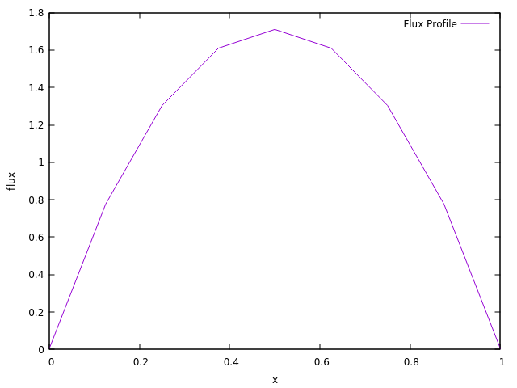
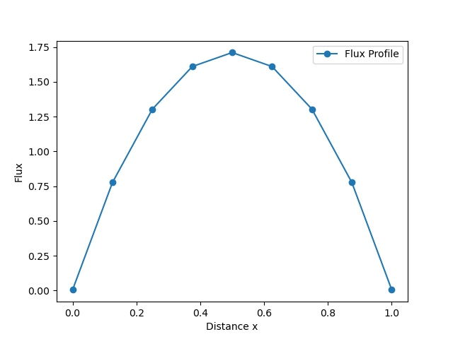
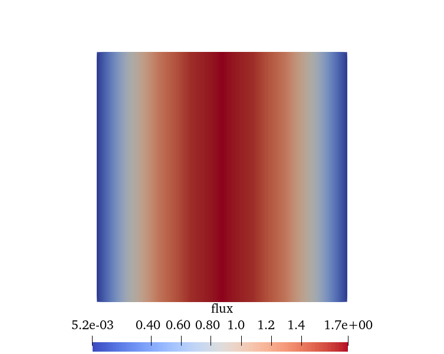

# 5 - Data Visualisation

The 1D diffusion solver is computing the neutron transport equation and outputs the solution i.e. flux into a file.
Here a few noteworthy methods of visualising the solution are discussed, ranging from easy-to-use, low level applications, to 3D interactive visualisation programs.

## gnuplot

gnuplot is an easy to use, yet very versatile command-line plotting tool that is common in scientific computing.
In Ubuntu - Linux one can install gnuplot via:

```sh
sudo apt update
sudo apt install gnuplot -y
```

For installation on Windows, you can download gnuplot from: <http://www.gnuplot.info/download.html>.
Alternatively, you can try and use Anaconda to install the package.

```sh
conda install -c conda-forge gnuplot
```

A small script by the name `fluxplot` in the `tools` directory is provided to help generate the figure in gnuplot.
The plot can be generated with the command:

```bash
gnuplot -p tools/fluxplot
```



## Python

Another very common way of visualising data is with Python and the `matplotlib` library.
The data output from the code is in the form of a space-delimited file which
can easily be read into Python using the `numpy` library.

A small script by the name `plot.py` in the `tools` directory is provided to help generate the figure in Python.

```sh
python3 tools/plot.py
```



## ParaView

One particular output viewing software that may be of interest to some readers is ParaView. ParaView is a widely used software for data analysis and visualisation within the scientific community. While ParaView could read in our text file outputs to generate a graph, this does not demonstrate much of the power of the software. Instead, the code has been written such that it will generate a 2-Dimensional plot of the flux that can be manipulated in ParaView.

To download ParaView please visit <https://www.paraview.org/download/>, while a user guide for ParaView can be found at: <https://docs.paraview.org/en/latest/>

ParaView is capable of reading various file formats. In this exemplar we will be focusing on generate an output file which uses the VTK ASCII file format. We have also made use of the more modern `.vtu` file type, a form of VTK file which makes use of an XML file structure. In addition to the readability we gain from such a structure, it is also recommended that users avoid the `.vtk` legacy file type if possible.

A snippet from **OutputFile.vtu** can be seen below, where we have specified that this is a `VTKFile` using the `Unstructured Grid` format. Contained within the Unstructured Grid, we define the number of **points** and **cells** within the problem. We then go on to describe the relevant **point** and **cell data**. The VTK file format is described in more detail [here](https://vtk.org/wp-content/uploads/2021/08/VTKUsersGuide.pdf).

```xml
<?xml version="1.0"?>
<VTKFile type="UnstructuredGrid" version="0.1" byte_order="LittleEndian">
  <UnstructuredGrid>
    <Piece NumberOfPoints="18" NumberOfCells="8"></Piece></UnstructuredGrid>
</VTKFile>
```

To load a file into ParaView you can either use the Open menu inside ParaView,
or from a terminal you can use the command:

```sh
paraview OutputFile.vtu
```


