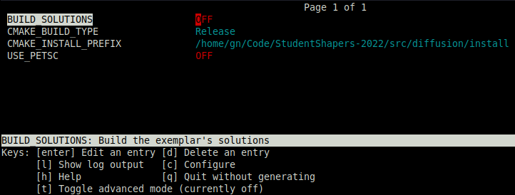

# 7 - Build Tools

## CMake

We have already briefly discussed the use of [`CMake`](https://cmake.org/) in the previous section [3 - Compilation Basics](3-compile-basics.md). More specifically we have covered:

- Building the project
- Compiling the project
- Building multiple configurations (Debug, Release)
- Passing options to the compiler, e.g. to disable a warning, or a preprocessor macro

In this section we will cover some additional aspects of `CMake`

- Peeking into the `CMakeLists.txt` and `CMake` syntax
- Enabling/disabling settings
- Find external libraries
- High level UI using `ccmake` and `cmake-gui`

### Anatomy of `CMakeLists.txt`

It is now time to peek into the `CMakeLists.txt` file and try and understand the syntax.
`CMkake` relies on a relatively simple syntax with extensive online documentation, which
you can view [here](https://cmake.org/cmake/help/latest/). It is based around the concept
of creating **targets** and then **configuring** the properties of the targets.

For example, the `diffusion` binary is defined as an **executable** target.

```cmake
cmake_minimum_required(VERSION 3.13)
project(diffusion)
enable_language(Fortran)

set(BIN_NAME diffusion)     # define a variable with name BIN_NAME
set(SOURCES                 # define a list with all the source file names
    src/Constants.F90
    src/Materials.F90
    src/Problem.F90
    src/Output.F90
    src/Matrix_Base.F90
    src/CRS.F90
    src/Solver.F90
    src/MatGen.F90)
# create a target with name BIN_NAME from files SOURCES + main.F90
add_executable(${BIN_NAME} ${SOURCES} app/main.F90)
```

The above snippet is enough to instruct `cmake` to compile the sources into
an executable.

Additional properties to a target e.g. it's output name, output location, etc. can be configured by using the
`set_target_properties` command.

```cmake
# Set additional properties for executable target
set_target_properties(${BIN_NAME} # this is the target's name
    PROPERTIES
    OUTPUT_NAME ${PROJECT_NAME} # use the project name for the binary
    RUNTIME_OUTPUT_DIRECTORY ${CMAKE_BINARY_DIR}/bin  # put binary in build/bin/
    Fortran_MODULE_DIRECTORY ${CMAKE_BINARY_DIR}/src) # put .mod in build/src/
```

Properties can also be set for the installation process.

```cmake
# by default installs to CMAKE_INSTALL_PREFIX
# you can override the behaviour by setting the variable to something similar to
# set(CMAKE_INSTALL_PREFIX ${CMAKE_CURRENT_SOURCE_DIR}/install CACHE STRING "")
# which would create an install folder in the root directory of the project.
set(INSTALL_BIN_DIR "bin")
# install the executable: specify the install location
install(TARGETS ${BIN_NAME}
    RUNTIME DESTINATION ${INSTALL_BIN_DIR}
    ARCHIVE DESTINATION ${INSTALL_BIN_DIR})
```

### Adding and toggling settings

As a project grows in complexity, often times you might want to define some
custom options, that turn on/off certain features, adds a compiler flag, ignores
certain source files etc. This can be done in `cmake` by using the `option` keyword.

Say that you have certain source files that you want to be able to compile, but
you don't want to do so by default, in this case the solutions to the exemplar exercises.
You can create the following option

```cmake
# defines a variable called BUILD_SOLUTIONS
option(BUILD_SOLUTIONS "Build the exemplar's solutions" OFF)
...
if(BUILD_SOLUTIONS)
    # compile the solutions only if BUILD_SOLUTIONS is ON
    ...
endif()
```

To toggle the settings of `cmake` without having to modify the `CMakeLists.txt` file,
similarly to building multiple configurations (Debug and Release)
by passing a command line option to `cmake`, in a terminal on would do

```bash
cmake .. -DBUILD_SOLUTIONS=ON   # from within the build/
```

### Finding external libraries

Many times you will want to incorporate an external library into your project
to add certain functionality. For example, you might want to
include a linear algebra library to make mathematical operations on matrices
easier. `CMake` offers a way to find these libraries via the
[`pkg_search_module`](https://cmake.org/cmake/help/latest/module/FindPkgConfig.html)

```cmake
find_package(PkgConfig) # enable the pkg_search_module
# look for library called libname and prefix all variables with MY_VAR_PREFIX
pkg_search_module(MY_VAR_PREFIX REQUIRED IMPORTED_TARGET libname)
```

### High level GUI using `ccmake` and `cmake-gui`

`ccmake` is a command line User Interface (UI) meant to be used
to interactively toggle project configuration settings. You can launch `ccmake`
after you have configured your project via

```bash
cmake ..    # from within build/
ccmake .
```



From `ccmake` you can then toggle settings and even expose all the predefined
`cmake` variables (by pressing <kbd>t</kbd>),
reconfigure the project (by pressing <kbd>c</kbd>),
read the help menus (by pressing <kbd>h</kbd>) and much more.

Similarly to the command line interface there is also a graphical interface
[`cmake-gui`](https://cmake.org/cmake/help/latest/command/cmake-gui.html)
which can perform the identical tasks. You can launch `cmake-gui` after you have
configured your project via

```bash
cmake ..    # from within build/
cmake-gui ..
```

For more information on `cmake` make sure to read the [online documentation](https://cmake.org/cmake/help/latest/). You can also try and go through the `CMakeLists.txt` file provided
in this project. It is well documented and uses various different features of `cmake`.
Feel free to also use it as a template for your own projects.

## FPM - Fortran Package Manager

[FPM](https://fpm.fortran-lang.org/en/index.html) stands for the Fortran Package Manager, and it is meant to be an easy-to-use
build and compilation tool, serving as an alternative to more complicated
build tools like `CMake` or `Make`.
Automatically, `fpm` assumes by default that the Fortran source files are in:

- `src/` for modules and procedure source
- `app/` main program(s) for applications
- `test/` main program(s) and support files for project tests
- `example/` main program(s) for example programs

Any additional settings can be specified in the `fpm.toml` configuration file.

```toml
name = "diffusion"
version = "1.0.0"

[build]
auto-tests = false
auto-examples = false
auto-executables = false
external-modules = ["petscsys", "petscksp", "petscvec", "petscmat"]

[library]
source-dir = "src"

[[executable]]
name = "diffusion"
source-dir = "app"
main = "main.F90"
link = ["petsc"]
```

To demonstrate how simple it is to build using `fpm`, we will build this project
alongside `cmake` by running:

```bash
fpm build
```

To run the program you can instruct `fpm` to do it for you by running:

```bash
fpm run
```

Or install it to a directory by running:

```bash
fpm install --prefix=./install
```

Additional flags to the Fortran compile can be passed with the `--flag` option

```bash
fpm run --flag "-DDEBUG"
```

For more information on how to use FPM, see the [FPM documentation](https://fpm.fortran-lang.org/en/index.html)
and the [FPM manifest](https://fpm.fortran-lang.org/en/spec/manifest.html)
